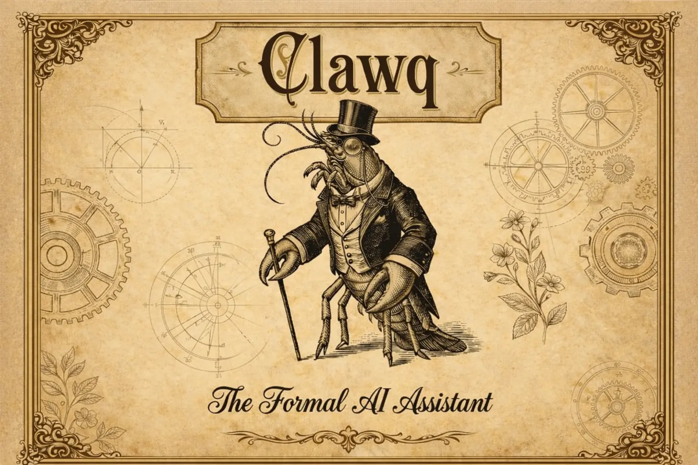

# Clawq — The Formal AI Assistant

<p align="center">
  
</p>

<p align="center">
  
</p>

A *formally* verified personal AI assistant runtime — Coq-proven core properties extracted to OCaml, with impeccable manners and machine-checked correctness. Multi-channel support (CLI, Telegram, Discord, Slack), HTTP gateway, cron scheduling, audit logging, and MCP server.

## Quick Start

### Prerequisites

- **opam** (OCaml package manager)
- **libsqlite3-dev** (or equivalent for your distro)

### Bootstrap and Build

```bash
# 1. Create opam switch "clawq-5.1" and install all dependencies
make bootstrap

# 2. Build
make build

# 3. Run tests
make test
```

### Getting Started with Telegram

The fastest way to get a running clawq instance is via Telegram:

1. Create a bot with [@BotFather](https://t.me/BotFather) and get your bot token.
2. Get an API key from an OpenAI-compatible LLM provider (OpenAI, Anthropic via proxy, etc.).
3. Generate a starter config:

```bash
./clawq onboard
```

4. Edit `~/.clawq/config.json` with your tokens:

```json
{
  "providers": [
    {
      "name": "openai",
      "api_key": "sk-...",
      "model": "gpt-4o"
    }
  ],
  "channels": {
    "telegram": {
      "enabled": true,
      "bot_token": "123456:ABC-..."
    }
  }
}
```

5. Start the daemon:

```bash
./clawq agent
```

Your bot is now live on Telegram. Send it a message to verify.

## CLI Commands

```
clawq agent           Start the daemon (agent loop, gateway, all configured channels)
clawq audit            View and manage the security audit log
clawq auth             Show API key status or encrypt plaintext secrets in config
clawq capabilities     List all active runtime capabilities
clawq channel          List configured channels
clawq cron             Manage cron jobs for scheduled agent messages
clawq doctor           Check configuration for common issues
clawq mcp              Start the MCP server (Model Context Protocol)
clawq memory           Show memory backend configuration
clawq migrate          Run database migrations
clawq models           List configured LLM providers and their default models
clawq onboard          Create a starter config file at ~/.clawq/config.json
clawq phase2           Show Phase 2 feature status
clawq reset-agent      Wipe all session history, cron jobs, and workspace files
clawq runtime          Manage native and Docker runtimes
clawq service          Manage the clawq system service (start/stop/restart)
clawq skills           Manage agent skills (shell-script tool extensions)
clawq status           Show runtime configuration and daemon status
clawq transcribe       Transcribe an audio file using the configured STT provider
clawq tunnel           Manage a public tunnel to the local gateway
clawq workspace        Print the current workspace directory
```

Run `clawq COMMAND --help` for per-command usage.

## Make Targets

| Target | Description |
|--------|-------------|
| `make bootstrap` | Create opam switch and install all dependencies |
| `make build` | Build the project |
| `make build-minimal` | Build minimal binary (`clawq-min`, core-only) |
| `make build-opt` | Optimized build (`OPT=speed` or `OPT=size`) |
| `make build-opt-speed` | Optimized build with `-O3` |
| `make build-opt-size` | Optimized build with `-O2 -compact` |
| `make build-opt-speed-stripped` | Stripped optimized speed build |
| `make build-opt-size-stripped` | Stripped optimized size build |
| `make build-opt-minimal` | Optimized minimal binary |
| `make test` | Run all tests |
| `make fmt` | Format code with ocamlformat |
| `make fmt-check` | Check formatting |
| `make extract` | Regenerate OCaml from Coq theories |
| `make extract-check` | Check for extraction drift |
| `make run` | Print CLI help |
| `make phase2` | Show Phase 2 feature status |
| `make clean` | Clean build artifacts |
| `make docker-build` | Build Docker image |
| `make docker-run` | Run daemon in Docker |
| `make verify-report` | Generate formal verification report and badge |
| `make release` | Build release artifacts |

## Run Daemon in Docker

```bash
# Build image
make docker-build

# Run daemon (foreground)
make docker-run

# Health check
curl http://127.0.0.1:3000/health
```

Direct Docker command:

```bash
docker run -it --rm -p 3000:3000 \
  -e CLAWQ_MASTER_KEY="your-passphrase" \
  clawq:latest agent
```

To persist config/state across restarts:

```bash
docker run -it --rm -p 3000:3000 \
  -v "$HOME/.clawq:/root/.clawq" \
  -e CLAWQ_MASTER_KEY="your-passphrase" \
  clawq:latest agent
```

## Extraction Workflow

```bash
# Regenerate src/extracted/ from Coq theories (requires Coq)
make extract

# Check whether extracted code has drifted from Coq sources
make extract-check
```

## Formal Verification

Core properties are machine-checked in Coq and extracted to OCaml via `coq/theories/Clawq/Extract.v`.

**69 theorems/lemmas** proven across 5 domains:

| Domain | Proofs | Key Properties |
|--------|--------|----------------|
| CLI parsing (`CliProofs.v`) | 22 | All 18 commands parse correctly; unknown input handled safely |
| Configuration (`ConfigProofs.v`) | 15 | Weight sums, port/temperature ranges, secure-by-default |
| Path safety (`PathSafety.v`) | 19 | No directory traversal; normalization idempotent; workspace containment |
| Audit chain (`AuditChain.v`) | 7 | HMAC chain integrity; append-only verification |
| Rate limiter (`RateLimiter.v`) | 6 | Token bucket bounds and monotonicity |

```bash
# Generate full report and badge
make verify-report
```

## Notes
- The generated extraction file path is `src/extracted/clawq_core.ml`.
